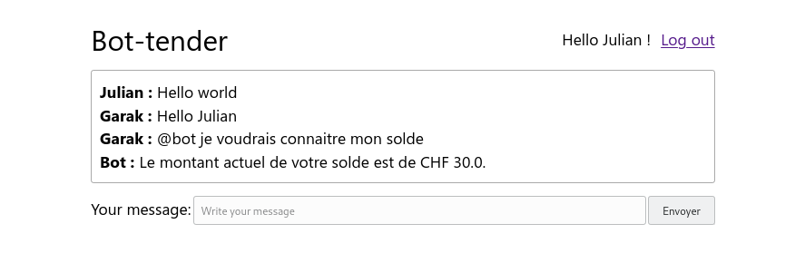
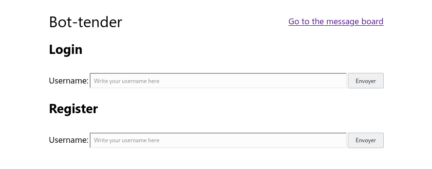
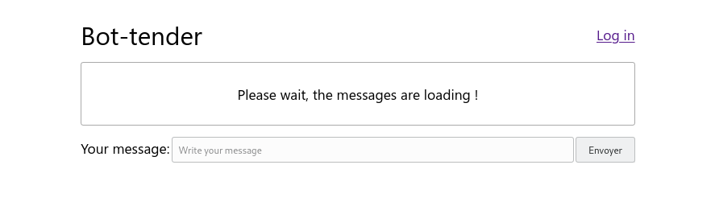
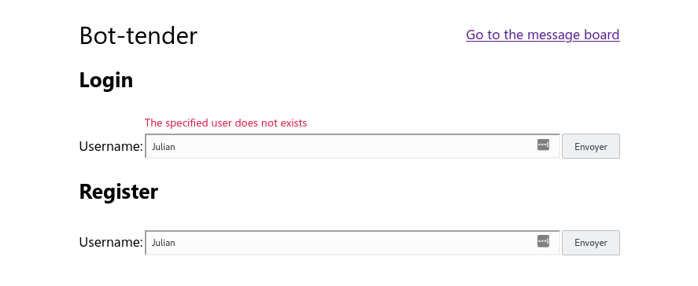
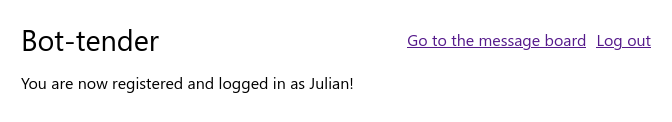
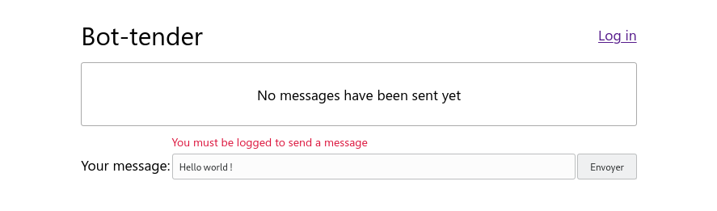
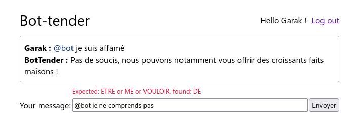

= Labo Bot-Tender Chatroom
Nastaran FATEMI <nastaran.fatemi@heig-vd.ch>; Christopher MEIER <christopher.meier@heig-vd.ch>
:revdate: 15 avril 2025
:lang: fr
:toc: auto
:toc-title: Table des matières
:course: Programmation Appliquée en Scala (PAS)
:xrefstyle: short

== Objectifs

L'objectif de ce labo est de créer un espace de discussion Web (__chatroom__) en 
utilisant Scala et de découvrir les bibliothèques https://com-lihaoyi.github.io/cask/[Cask] et 
https://com-lihaoyi.github.io/scalatags/[ScalaTags]. Dans cet espace de discussion, plusieurs utilisateurs pourront communiquer ensemble. Les messages de chacun seront visibles par tous
sur une page Web.

* __Cask__ est un framework HTTP simple en Scala inspiré par le projet Flask de Python.
* __ScalaTags__ est un moyen simple et rapide de générer du code HTML/XML/CSS en utilisant Scala.
* Les avantages de ces deux bibliothèques sont qu'elles sont légères, elles intègrent bien les 
constructions Scala et qu'elles évitent l'utilisation de frameworks complexes pour des cas
simples.

Ce laboratoire intègre le bot implémenté lors du Labo 2. Un utilisateur pourra ainsi
communiquer avec le bot-tender depuis l'espace de discussion.

== Indications

Le code source du labo vous est fourni via une pull request sur le repo github. Elle contient la pré-implémentation du laboratoire 3. 

Pour récupérer ces nouveautés il vous suffit de *merge* (eventuellement de résoudre les conflits).

* Ce laboratoire est à effectuer par groupe de 3, en gardant les mêmes formations que pour le labo 2. Tout plagiat sera sanctionné par la note de 1.
* La date de rendu est indiquée sur GitHub Classroom.
* Votre implémentation du labo 2 doit être intégrée à ce laboratoire. Si vous le souhaitez vous pouvez utiliser l'implémentation d'un de vos collègues (n'oubliez pas d'indiquer la source en commentaire).
* Il n'est pas nécessaire de rendre un rapport, un code propre et correctement commenté suffit. Faites cependant attention à bien expliquer votre implémentation.
* Faites en sorte d'éviter la duplication de code.
* Préférez un style de programmation fonctionnel.
* Préférez l’utilisation de `val` par rapport à `var`.

Pour faire ce laboratoire, il faut dans un premier temps parcourir les fonctionnalités principales fournies par ces deux bibliothèques via les deux liens suivants~: 
https://com-lihaoyi.github.io/cask/[Cask] et 
https://com-lihaoyi.github.io/scalatags/[ScalaTags]. Vous allez ensuite utiliser certaines de ces fonctionnalités lors des étapes d'implémentation.

=== Rendu

Pour ce laboratoire, qui est la deuxième partie d'une série utilisant le même dépôt, nous vous demandons de créer un tag sur le commit de votre rendu. Suivez les étapes ci-dessous :

1. Commitez votre travail (ex. `git commit`).
2. Créez un tag annoté nommé `rendu-chatroom` sur le commit actuel (ex. `git tag -a rendu-chatroom`). Dans le commentaire du tag, indiquez si vous avez rencontré des problèmes éventuels.
3. Pushez le tag créé (ex. `git push origin rendu-chatroom`).
4. Vérifiez dans votre navigateur que le tag est bien disponible.

== Description

Le site Web de chatroom est composé de deux pages principales:

. La page d'accueil, qui contiendra les messages de l'espace de discussion ainsi qu'un formulaire pour envoyer
un nouveau message. (voir <<screenshot-home-page>>)
. La page de login et d'inscription, qui contiendra respectivement les formulaires pour connecter un utilisateur existant et pour créer un nouvel utilisateur. (voir <<screenshot-login-page>>)

Afin d'explorer les capacités de la bibliothèque *Cask*, nous allons implémenter plusieurs manières de communiquer entre le navigateur et le serveur, telles que l'envoi de formulaires POST ou encore la souscription à un websocket.

== Implémentation

Pour vous guider dans votre implémentation, nous avons établis des étapes. Le code source qui vous
est fourni fait référence à ces étapes dans des commentaires (`// TODO - Part Chatroom Step N`).

=== Étape 1 : Rendre disponible les fichiers statiques

Complétez la classe `StaticRoutes` de sorte que les fichiers statiques `js/main.js` et `css/main.css` (situés dans le dossier `src/main/resources`) soient disponibles depuis le navigateur.

=== Étape 2 : Mettre en place la page d'accueil

* Dans la classe `MessagesRoutes`.
* En utilisant ScalaTags, créer la structure HTML qui correspond à la <<model-login-page>>. La page doit être disponible depuis l'URL `/`.
* Ajouter les méthodes (de préférence factorisées) qui génèrent l'HTML dans l'objet `Layout`.
* La <<model-login-page>> indique la structure HTML des captures d'écran. Les éléments en gras indiquent les attributs nécessaires au code JavaScript fourni.
* Les messages seront chargés et affichés à l'étape 4. Par défaut, afficher un texte centré indiquant que les messages sont en cours de chargement (voir la <<screenshot-home-page-step2>>).
* Lier les fichiers CSS et JavaScript de l'étape 1 au code HTML.

=== Étape 3 : Mettre en place les fonctionnalités de login

* Dans la classe `UsersRoutes`.
* En utilisant ScalaTags, créer une page permettant de se connecter et de s'inscrire. La page doit être disponible depuis l'URL `/login`.
* Si le nom d'utilisateur de la tentative de connexion n'existe pas sur le serveur, il faut afficher un message d'erreur (voir <<screenshot-login-error-page>>).
* Le formulaire de connexion doit envoyer à l'URL `/login` une requête POST avec le nom d'utilisateur en utilisant le format "form".
* Le formulaire d'inscription doit envoyer à l'URL `/register` une requête POST avec le nom d'utilisateur en utilisant le format "form".
* Une connexion ou inscription réussie doit afficher une page indiquant le succès (voir <<screenshot-login-success-page>>).
* L'accès à l'URL `/logout` doit déconnecter l'utilisateur actuel et afficher une page Web indiquant le succès.
* L'identité de l'utilisateur connecté est stockée dans une session. Le code permettant de récupérer la session actuelle est fourni dans la classe `Decorators`.

=== Étape 4 : Traitement des messages

* Dans la classe `MessageImpl`, implémenter le stockage des messages de l'espace de discussion.
* En plus du nom de l'expéditeur et du contenu du message, `MessageService` stocke également les infos suivantes, si elles existent :
    ** Le nom de l'utilisateur mentionné dans le message. Un message mentionne un utilisateur si le message commence par "@". Par exemple, le message "@Julian Hello" mentionne l'utilisateur "Julian".
    ** Le type de la requête (`ExprTree`) envoyé au Bot. Par exemple, le message "@bot Hello" doit avoir le type `Greeting`.
    ** L'id du message auquel le message actuel répond. Par exemple, le message du bot qui répond à un message de requête a une référence vers l'id du message de requête.
* Dans la classe `MessagesRoutes`, implémenter la réception des messages envoyés par le formulaire à l'URL `/send` au format JSON (code JavaScript fourni). Doit retourner un objet JSON qui indique si l'envoi a réussi et si non, quel est le message d'erreur (voir figure <<screenshot-home-error-page>>).
* Le code JavaScript fourni se connecte à un websocket depuis l'URL `/subscribe`. À chaque nouvelle notification, il met à jour (remplace le contenu de `#boardMessage`) les messages affichés avec les 20 derniers messages. Vous devez implémenter les endpoints pour que lorsqu'un utilisateur envoie un message, tous les utilisateurs le reçoivent immédiatement.
* Un GET sur l'endpoint `/clearHistory` doit supprimer tout l'historique des messages (aussi sur les autres clients).

=== Étape 5 : Intégrer le bot-tender à l'espace de discussion

* Modifier la classe `MessagesRoutes` pour que les messages qui commencent par `@bot` soient traités par le Bot-tender implémenté au Labo 2.
* La réponse du bot est envoyée sur l'espace de discussion et est donc visible par tout le monde.
* Le bot doit utiliser l'utilisateur connecté depuis la page de login.
* Un message que le bot n'arrive pas à comprendre doit renvoyer une erreur dans la réponse JSON. L'erreur ne doit *pas* être affichée comme un message (voir <<screenshot-home-boterror-page>>).

== FAQ

=== Le serveur démarre mais le navigateur Windows n'arrive pas à s'y connecter (WSL2)

Par défaut, Cask n'écoute que sur l'adresse `127.0.0.1` (loopback interne à WSL2). Si vous utilisez Windows avec WSL2, le navigateur Windows communique avec WSL2 via l'interface réseau virtuelle `eth0`, et non via le loopback. Le serveur est donc inaccessible depuis Windows.

Pour y remédier, configurez Cask pour écouter sur toutes les interfaces réseau en ajoutant le code suivant dans la classe `MainChatroom` :

[source,scala]
----
override def host: String = "0.0.0.0"
----
