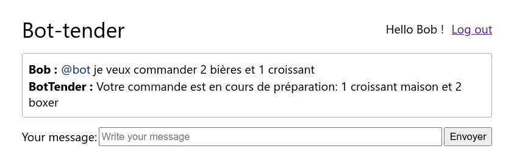
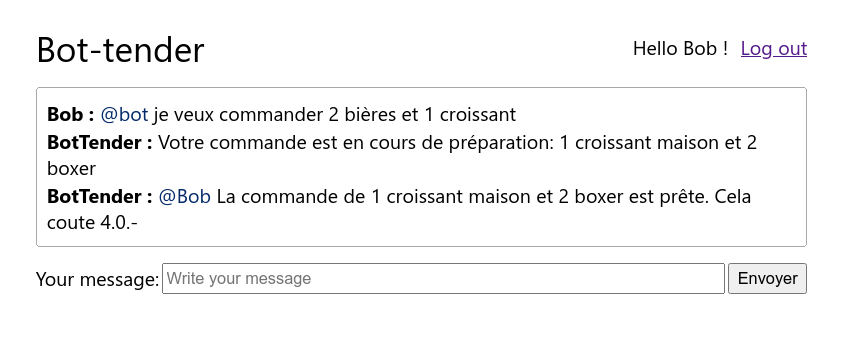
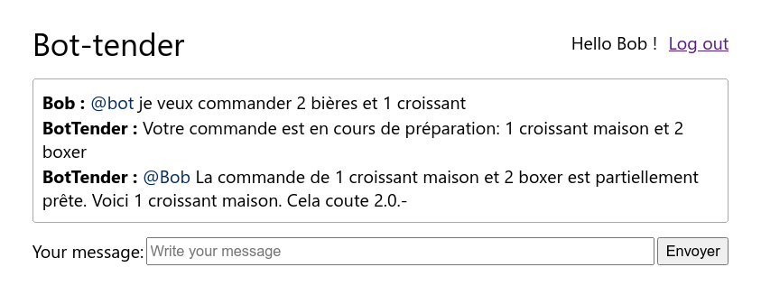
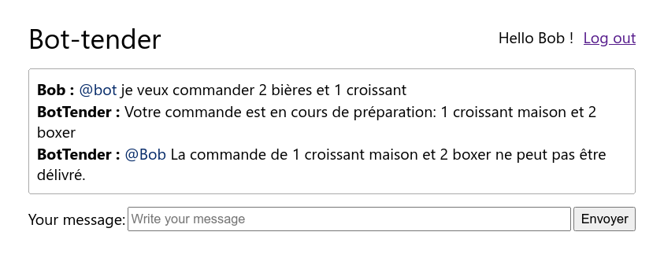

= Labo Bot-Tender Future
Nastaran FATEMI <nastaran.fatemi@heig-vd.ch>; Christopher MEIER <christopher.meier@heig-vd.ch>
:revdate: 20 mai 2026
:lang: fr
:toc: auto
:toc-title: Table des matières
:course: Programmation Appliquée en Scala (PAS)
:xrefstyle: short

== Objectifs

Dans les itérations précédentes de Bot-tender, on supposait une commande prête immédiatement. L'objectif de ce labo est d'intégrer une gestion de commandes asynchrones en utilisant la classe `Future` de l'API Scala.

Ce laboratoire intègre le travail implémenté lors du Labo 2 et 3.

== Indications

Le code source du labo vous est fourni via une pull request sur le repo github. Elle contient la pré-implémentation du laboratoire 4. 

Pour récupérer ces nouveautés il vous suffit de *merge* (eventuellement de résoudre les conflits).

* Ce laboratoire est à effectuer par groupe de 3, en gardant les mêmes formations que pour le labo 3. Tout plagiat sera sanctionné par la note de 1.
* La date de rendu est indiquée sur GitHub Classroom.
* Votre implémentation du labo 3 doit être intégrée à ce laboratoire. Si vous le souhaitez vous pouvez utiliser l'implémentation d'un de vos collègues (n'oubliez pas d'indiquer la source en commentaire).
* En plus du code source, il faut rendre un fichier README contenant une explication de vos choix architecturaux et d'implémentation (pas plus que 2 pages).
* Faites en sorte d'éviter la duplication de code.
* Préférez un style de programmation fonctionnel.
* N'utilisez pas `Future.onComplete` ou `Await`.
* On vous fournit la classe `MainFuture` comme point d'entrée pour ce labo.

== Description

. Une commande peut prendre un certain temps avant d'être prête.
. Directement après la commande, le bot indique qu'elle est en cours.
. Chaque type de produit (marque) a un temps de préparation qui lui est propre.
    * Par exemple : une bière Farmer peut prendre plus de temps à préparer qu'une bière Boxer.
    * On vous fournit la fonction `Utils.FutureOps.randomScheduled` qui simule un temps d'attente (éventuellement avec échec).
. Pour une même commande, les produits de types différents doivent être préparés en parallèle mais les produits de même type doivent être préparés l'un après l'autre.
    * Par exemple : Si on commande 2 croissants maison et 1 croissant Cailler, la préparation du croissant Cailler et du premier croissant maison se déroule en parallèle alors que la préparation du deuxième croissant maison commence quand le premier croissant maison est prêt.
. La préparation d'un produit peut échouer, dans ce cas on sert une commande partielle avec les produits qui ont pu être préparés.
. Dès que la commande est prête (complète ou partielle), le bot envoie un message qui mentionne l'utilisateur qui a effectué la commande ainsi que le statut de la commande. La gestion des *race conditions* lors de l'ajout des messages est implémentée pour vous dans la classe `Data.MessageConcurrentImpl`.
. Le prix des produits servis est prélevé lorsque la commande est prête. Il faut donc modifier `AccountService` pour supporter un accès concurrent.
    * Par exemple en utilisant `scala.collection.concurrent`.

Voir <<screenshotwaitingcommand>>, <<screenshotfullcommand>>, <<screenshotpartialcommand>> et <<screenshotfailedcommand>> pour un exemple d'exécution.

== Concurrence

L'API Scala fournit une https://scala-lang.org/api/3.x/scala/collection/concurrent/TrieMap.html[collection] qui permet l'accès et la modification concurrente à ses éléments.

La méthode https://scala-lang.org/api/3.x/scala/collection/concurrent/TrieMap.html#updateWith-fffffbdb[`updateWith`] de `TrieMap` est particulièrement intéressante car elle permet la mise à jour atomique et conditionnelle d'une valeur de la collection.
